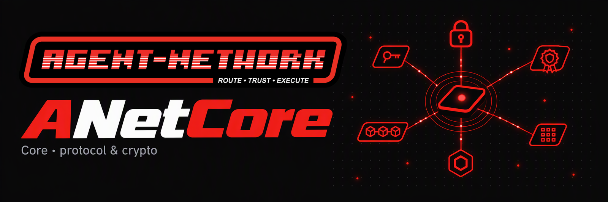
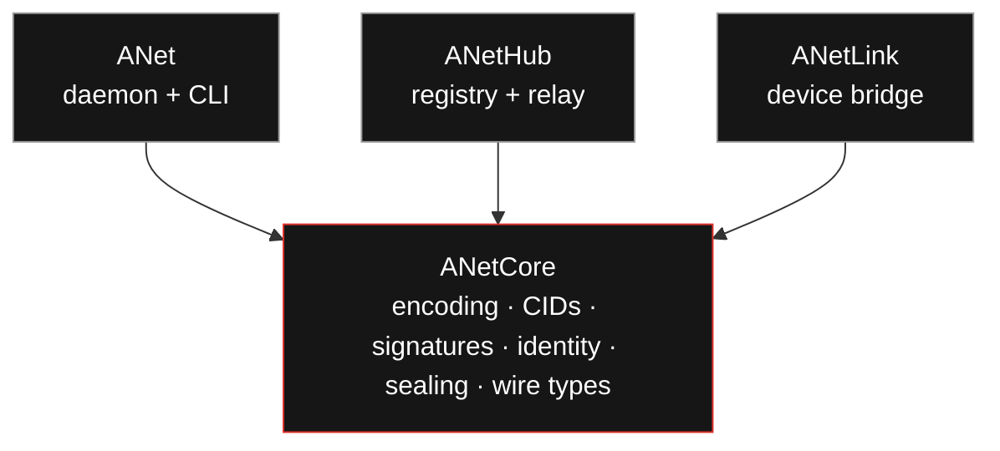

<div align="center">



<h3>The protocol kernel of ANet: deterministic encoding, content addressing, signatures, identity and end-to-end sealing.</h3>

Pure logic, zero I/O. Pinned by golden vectors.

[](https://pkg.go.dev/github.com/ANetResearch/ANetCore)
[](https://github.com/ANetResearch/ANetCore/actions/workflows/ci.yml)
[](https://github.com/ANetResearch/ANetCore/tags)
[](go.mod)
[](LICENSE)

[ANet (client)](https://github.com/ANetResearch/ANet) · [ANetHub (hub)](https://github.com/ANetResearch/ANetHub) · [Changelog](CHANGELOG.md) · [Scope](docs/scope.md)

</div>

---

ANetCore is the part of [ANet](https://github.com/ANetResearch/ANet) — the A2A network for AI agents —
that has to be byte-for-byte identical everywhere: how objects are encoded, hashed, signed and sealed, and
how an agent's identity is derived and verified. Everything that touches a network or a disk lives in the
applications (the [ANet](https://github.com/ANetResearch/ANet) daemon,
[ANetHub](https://github.com/ANetResearch/ANetHub) and the ANetLink device bridge). They all import this
module and never each other, so a wire type is defined once and cannot drift between a daemon and a hub.



## Packages

| Package | Implements | Spec anchor |
|---|---|---|
| `coredet` | CoreDet-CBOR — RFC 8949 §4.2 Core Deterministic Encoding profile (C-R1/C-R2 restrictions, C-D1–D3 riders) | `_CONVENTIONS §2` |
| `anetcid` | CIDv1 · dag-cbor · sha2-256, frozen prefix `0x01 0x71 0x12 0x20`, multibase `b` | `_CONVENTIONS §3` |
| `aobj` | AObjEnvelope — detached Ed25519 (COSE alg −8) signature over canonical preimages; verify-before-use | `_CONVENTIONS §5` |
| `identity` | KEL/AID — KERI-style key event log, pre-rotation, AID derivation | arch-03 P1 |
| `seal` | End-to-end relay envelope: signed `EncKeySet`, sign-then-encrypt `SealedEnvelope` (HPKE Base, X25519 / HKDF-SHA256 / ChaCha20-Poly1305), Padmé padding | A2A-DESIGN §3 |
| `a2acard` | A2A AgentCard signing and verification: RFC 8785 JCS + JWS EdDSA, standard library only | A2A-DESIGN §10.3 |
| `payment` | x402 wire objects + the `anet-credit` scheme: signed authorizations and settlement receipts | x402 v2 |
| `relayauth` | The canonical challenge a client signs to authenticate a hub request (v1 and v2) | arch-03 |
| `delegation` | The relayed task wire: signed request, completion, chat; `VerifyDelegateReq`, `VerifyResult` | arch-03 |
| `evidence` | Receipt + Review — the interaction-anchored trust pair anyone can verify | evidence-spec |
| `ael` | Agent Event Ledger — per-DID append-only anti-fork hash chain (P6) | evidence-spec |
| `tsir` | TaskDoc, closed predicate calculus, `EffectRecord`, acceptance evaluation | tsir-spec |
| `effect` | The execution-effect envelope: what happened, whether it is verifiable, the metrics a TSIR predicate evaluates | contracts C1/C4 |
| `adp` | AgentCard — capability self-description, typed CID mounts | adp-spec |
| `agenturi` | `agent://` URI scheme — parsing and canonical form | agent-uri-spec |
| `golden` | Conformance vectors — the byte-for-byte oracle | `_CONVENTIONS §8` |

Spec anchors refer to the `design3` specification corpus (`_CONVENTIONS` plus per-protocol specs) and to
ANet's [A2A alignment design](https://github.com/ANetResearch/ANet/blob/main/docs/A2A-DESIGN-zh.md).

## Use

```sh
go get github.com/ANetResearch/ANetCore@latest
```

```go
ctrl, _ := identity.Incept()                                            // a new self-certifying AID and its key event log
pre, _ := coredet.Marshal(map[string]any{"goal": "hello"})             // canonical (deterministic) CBOR preimage
cid, _ := anetcid.Sum(pre)                                              // content id: CIDv1 · dag-cbor · sha2-256
sig, seq := ctrl.Sign(pre)                                              // Ed25519 under the current key
err := identity.VerifyObject(ctrl.KEL(), ctrl.AID(), seq, 0, pre, sig) // verify against the key history
```

## Conformance

`go test ./...` includes the golden-vector suite: canonical preimage bytes, CIDs and signatures under the
frozen suite test key (`seed = SHA-256("anet-suite-test-key-v1")`), plus RFC 9180 (HPKE) and RFC 8785
(JCS) vectors, and A2A cards signed by the a2a-python reference SDK. Two independent implementations that
pass these vectors produce byte-identical wire objects.

## Versioning and verifying releases

- Semantic versioning; changes per version in [CHANGELOG.md](CHANGELOG.md). Pre-1.0, a minor version may
  add wire objects, and every object that existed before encodes to the same bytes when the new optional
  fields are absent (pinned by `golden/`). Any change that alters existing bytes on the wire (preimage
  membership, CID prefix, envelope shape) is a **major** version. The CID prefix and the suite test key
  are frozen.
- **v0.15.0** is the kernel of anet 0.2.0 and hub wire 2: it adds `seal` and `a2acard` and the relayauth
  v2 preimage.
- Releases are Git tags consumed as Go modules. The `go` command checks every module it downloads against
  the public Go checksum database ([sum.golang.org](https://sum.golang.org)), so the bytes you build are
  the bytes everyone else builds; `go mod verify` re-checks the module cache.
- The binaries built on this kernel — `anet` releases — are signed with the anet release key; see ANet's
  [SECURITY.md](https://github.com/ANetResearch/ANet/blob/main/SECURITY.md).

## Scope and dependencies

A function belongs here only if it is deterministic, I/O-free, and needed by at least two applications or
pinned by a golden vector. External dependencies are frozen to four families — `fxamacker/cbor`,
`filippo.io/edwards25519`, `golang.org/x/crypto`, `golang.org/x/text` — plus the multiformats CID
libraries; standard-library packages that carry a decision (`crypto/hpke`, Go 1.26) are recorded too. See
[docs/scope.md](docs/scope.md). Module design rationale: ANet `docs/CONTRACTS-zh.md` (the five contracts).

## License

**ANet Open Source License**, a modified Apache License 2.0 ([LICENSE](LICENSE)), the same license as
ANet and ANetHub. Commercial use is allowed, including as a library in your own product; the logo
condition does not apply to library use. Operating a multi-tenant hosted hub for third parties needs
written authorization. The A2A specification work (ANet `docs/a2a/`) and code contributed to the A2A
project are plain Apache-2.0. Questions: hi@anet0.com.
